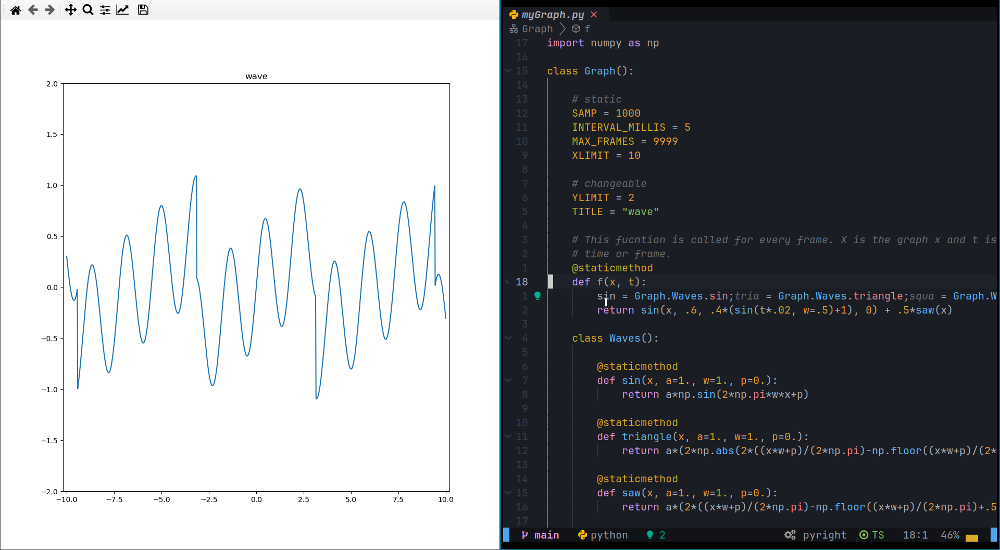

# Hot reload graph matplotlib

A hot reloadbale graph that can be animated.
To use you need to start tme main script and as you change
the f function in myGraph.Graph module and save the file
it will update.

## Images

